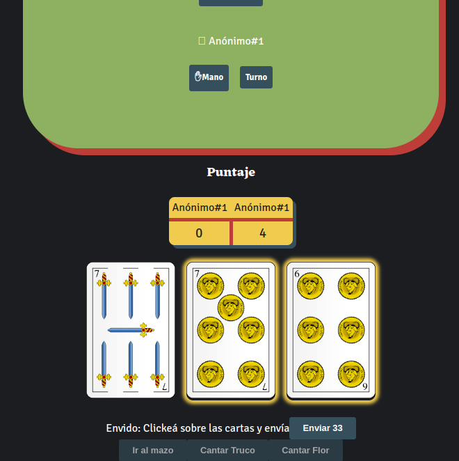

# WebSocket TRUCO

Juego de Truco Argentino usando websockets

<p align="center">
  
</p>

Permite jugar partidas mano a mano(sólo 2 jugadores a 15 puntos, de momento...)

## Setup
Necesitás docker y docker compose.

```
git clone https://github.com/gabtar/web-truco.git
cd web-truco/
docker compose up
```

Ingresar a la web en `http://localhost:3000`
